# Chess & Tic-Tac-Toe in C++

This project aims to simulate a Morpion and Chess game. Both of this games needs two players. Both have two modes, PvP and PvC.
The computer is assumed to adopt the less risky strategy, that is, its behaviour is dictated by the well-known MinMax algorithm, or more particularly, its AlphaBeta variant. 

A fair amount of programming skill is required to achieve this projects, as it relies on advanced C++ features such as polymorphisms and the Standard Library.
C++ is known to be a challenging imperative language to master, it is a low-level language. It does not require a perfect mastery of 
complex librairies such as PyTorch, but a good understanding of what is happening deep down the computer.

The Morpion and Chess games derive from the same virtual class: **Position**, **Piece** and **type_piece**; hence they are regrouped in the same repo, but 
keep in mind that they are distinc implementation.

## Tic-Tac-Toe

The implementation is easy and mostly serves of testing case of the overall algorithm. With a correct implementation
of the MinMax algorithm, it is impossible to win a Morpion game, as the adversary will always have a counter available.
Nonetheless, if the player plays a bad move, it can lose. Thus, a standard play ends up in a draw, hence the inherent limited interest
of this case.

Below is an illustration of a game when the user plays correctly. As expected, it ends in a draw.

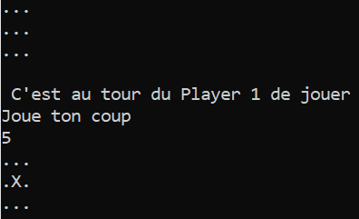 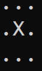 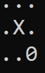

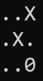 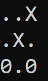

Here is another example where the computer is given the opportunity to win.

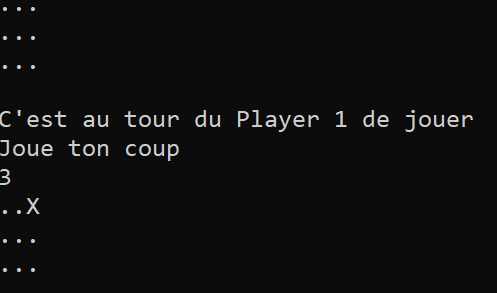 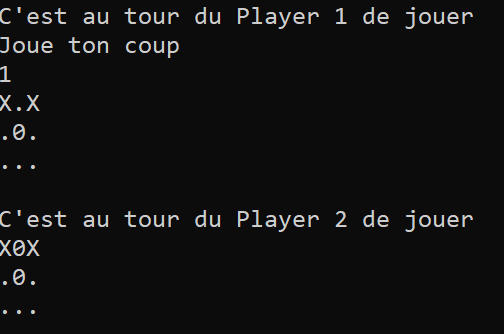 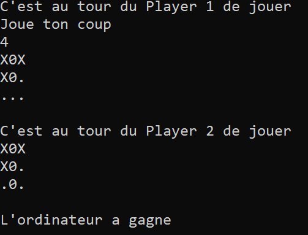

## Chess

I implemented two modes; a Player Vs. Player (said PvP) and a Player vs. Computer (said PvC). As said above, the PvC is coded with the MinMax algorithm, which requires exploring recursively a tree.
MinMax needs at least two others functions: **Position_possible**, which forms one level of the tree by listing all the potentials subsequent positions, and **valeur_position** which computes 
the value of a given position, formulated by a heuristic.

The implementation of the Chess game is clearly more tricky; at every turn, there is on average 40 possibilities of a move. It justifies the necessity to implement a
more optimized version of the MinMax algorithm, the AlphaBeta variant. If the memory is
not managed correctly, the stack will be very quickly saturated, making the computer have a really bad time after two or three turns. The skeleton of the algorithm is the same than for the Tic-Tac-Toe implementation, 
the functions in details are more diverse and intricate though since the game is much richer overall.

Below an illustration of the beginning of a game.

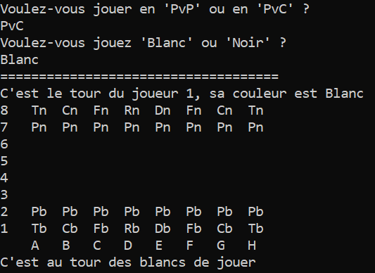 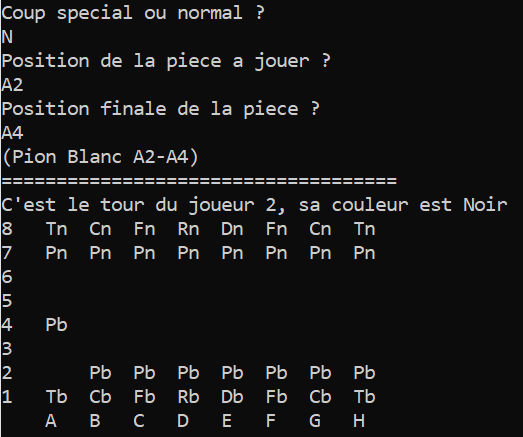 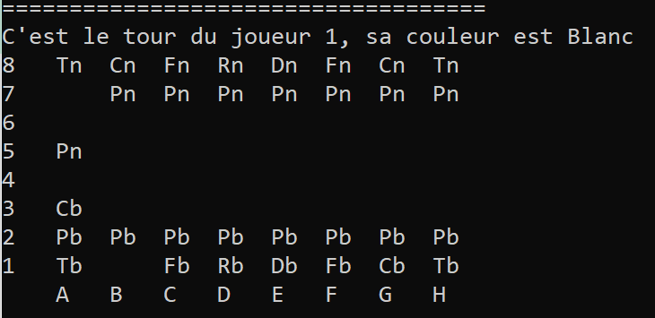

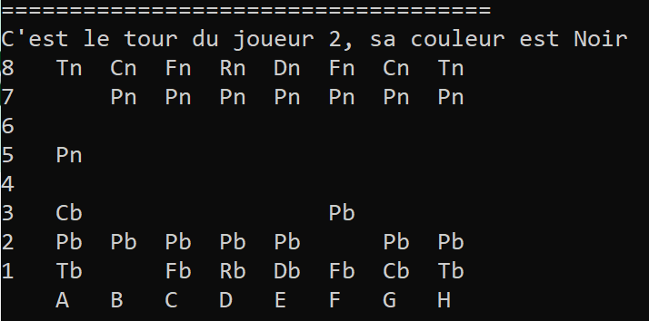 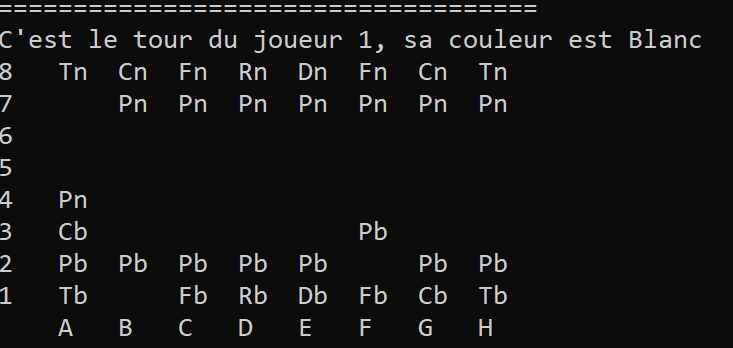