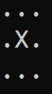
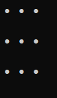
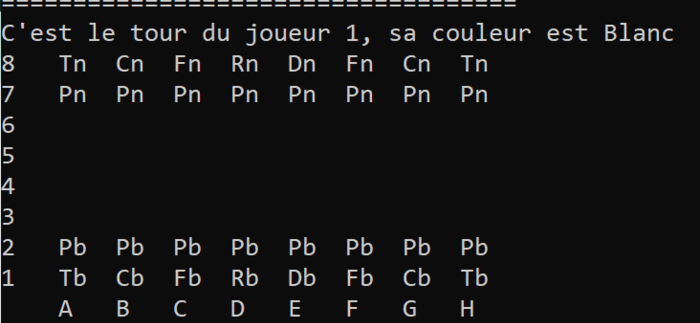

# Chess & Tic-Tac-Toe in C++ from scratch

This project aims to simulate a Tic-Tac-Toe and Chess game. Both of this games needs two players in theory. 
In practice though, one player will be the computer itself! Here, it is assumed to adopt the less risky strategy, that is, its behaviour is dictated by the well-known [MinMax algorithm](https://en.wikipedia.org/wiki/Minimax). This algorithm is the most common, yet subtil, algorithm to make strategic decisions in two-players turn-based games.

A fair amount of programming skill was required to achieve this projects, as it relies on advanced C++ features such as polymorphisms or the Standard Library.
C++ is known to be a challenging imperative language to master, it is low-level and memory leakage can happen at any moment if not enough care is taken. Contrarily to higher level language like Python, it does not require a perfect mastery of complex librairies such as `PyTorch`, but rather a very good comprehension of how class constructors, deleter, pointers/references and memory management works.

## 💻 🤖 Description of the code

The Morpion and Chess games derive from the same virtual class: **Position**; hence they are regrouped in the same repo, but keep in mind that they are distinc implementations. The other classes are specific to each game.

A [tree data structure](https://en.wikipedia.org/wiki/Tree_(abstract_data_type)) is coherently implemented to represent all the potential subsequent positions. Each level of the tree is given a number naming the player's turn. Since one considers only turn-based games with two players, this number alternates at every level between $0$ and $1$.
As said above, the computer player is coded with the MinMax algorithm, which requires exploring recursively a tree.
MinMax needs at least two others functions: **Position_Possible**, which forms one level of the tree by listing all the potentials subsequent positions, and **valeur_position** which computes the value of a given position, formulated by a heuristic. The decision-making is based on this value.

Storing the whole board for every possible position would be too expensive in terms of memory. To offset this difficulty, a board of reference is kept along the game, and only the list of move from the board of reference to the actual position is kept in memory. In that sense, the idea is similar to how `git` stores all your commits.
An important method **mise_a_jour_position** efficiently updates the reference board regarding the list of moves stored.

Let's give a brief description of the code for each game.

### For Tic-Tac-Toe

The only class created is `Position\_Morpion`. This class attributes are:

1 A grille object. It will plays the role of reference board.
2 A list of move. Stores the moves to apply to go from a reference board to the actual board.
3 A pointer towards a sister `Position\_Morpion`.
4 A pointer towards a children `Position\_Morpion`.

### For Chess

The classes are `Position_Echec`, `Coup_Echec`, and `Piece`. `Position_Echec` naturally describes the chessboard, somewhat in the same manner that `Position_Morpion`.
`Coup_Echec` describes chess's move and `Piece` is the basic building block of the chessboard. `Piece` derives from the more fundamental class `Type_Piece`  which states the name, the value and a list of the possible
relative displacement allowed for a piece. Each piece stores its color and position on the chessboard.

## ❌ ⭕ Tic-Tac-Toe

The implementation is easy and mostly serves of testing case of the overall algorithmic structure. With a correct implementation
of the MinMax algorithm, it is impossible to win a Tic-Tac-Toe game, as the adversary will always have a counter available; that is, you can not outsmart the computer.
Nonetheless, if the player plays a bad move, the algorithm will directly leverage the vulnerability, making the loss of the former inevitable. Thus, a standard play ends up in a draw, hence the inherent limited interest
of this case.

Below is an illustration of a game when the user plays correctly. As expected, it ends in a draw.

Here is another example where the computer is given the opportunity to win.

## ♟️ Chess

I implemented three modes; a Player Vs. Player (said `PvP`), a Player vs. Computer (said `PvC`), and a Computer vs. Computer (said `CvC`). 

The implementation of the Chess game is clearly trickier; at every turn, there is on average 40 possibilities of a move. It justifies the necessity to implement a more optimized version of the MinMax algorithm, [the AlphaBeta variant](https://en.wikipedia.org/wiki/Alpha%E2%80%93beta_pruning). This variant allows to cute leaves, also called **pruning**, of the exploratory tree, that are judged useless to investigate. It drastically reduces the complexity and number of possibilities to explore. Alpha-Beta variant is not based on an heuristic, it is exact and apply to every game the MinMax works on.

If the memory is not managed correctly, the `heap` will be very quickly saturated, making the computer have a really bad time after two or three turns. The skeleton of the algorithm is the same than for the Tic-Tac-Toe implementation, 
the functions in details are more diverse and intricate though since the game is much richer overall.

Below an illustration of a game. This is `CvC mode`, and the MinMax's tree has a depth of 3 stages.

You can observe very few initiatives are taken. This is due to the nature of MinMax algorithm, it fosters careful behaviours and impedes risky moves. 

Try it yourself! 
