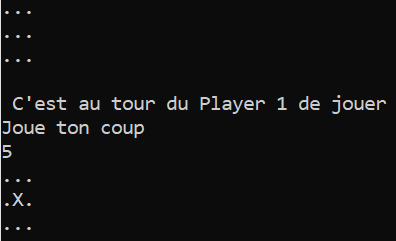
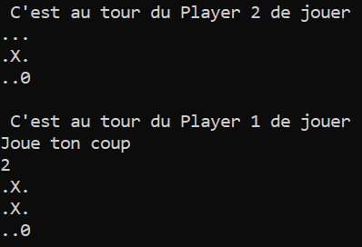
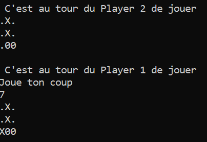
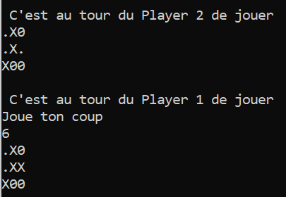
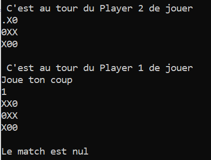

# C++ project

This project aims to simulate a Morpion and Chess game. Both of this games needs two players. Both have two modes, PvP and PvC.
The computer is assumed to adopt the less risky strategy, that is, its behaviour is dictated by the well-known MinMax algorithm, or more particularly, its AlphaBeta variant. 

A fair amount of programming skill is required to achieve this projects, as it relies on advanced C++ features such as polymorphisms and the Standard Library.
Also, given the exponential growth of the number of move in Chess, some peculiar care have to be given to the computational costs and memory management.

The Morpion and Chess games derive from the same virtual class: **Position**, **Piece** and **type_piece**; hence they are regrouped in the same repo, but 
keep in mind that they are distinc implementation.

## Tic-Tac-Toe

The implementation is easy and mostly serves of testing case than is of real interest. With a correct implementation
of the MinMax algorithm, it is impossible to win a Morpion game, as the adversary will always have a counter available.
Nonetheless, if the player plays a bad move, it can lose. Thus, a standard play ends up in a draw, hence the limited interest
of this case.

  

 

Here is another example where the computer is given the opportunity to win.

## Chess

