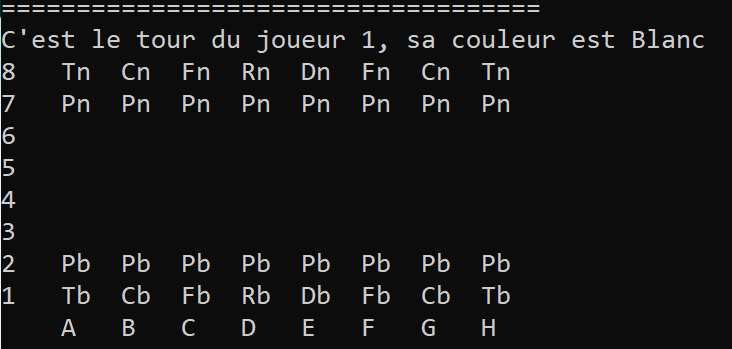
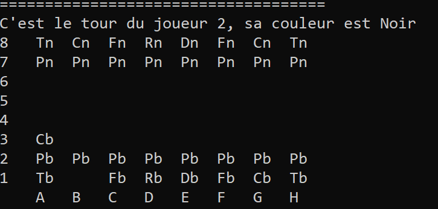

# Chess & Tic-Tac-Toe in C++

This project aims to simulate a Tic-Tac-Toe and Chess game. Both of this games needs two players in theory. 
In practice though, one player will be the computer itself! Here, the computer is assumed to adopt the less risky strategy, that is, its behaviour is dictated by the well-known MinMax algorithm. This algorithm is the most common, yet subtil, algorithm to make strategic decisions in two-players turn-based games.

A fair amount of programming skill was required to achieve this projects, as it relies on advanced C++ features such as polymorphisms or the Standard Library.
C++ is known to be a challenging imperative language to master, it is low-level and memory leakage can happen at any moment if not enough care is taken. Contrarily to higher level language such as Python, it does not require a perfect mastery of 
complex librairies such as PyTorch, but rather a good comprehension of a class constructors, deleter, pointers/references and memory management in general.

## 💻 🤖 Description of the code

The Morpion and Chess games derive from the same virtual class: **Position**; hence they are regrouped in the same repo, but 
keep in mind that they are distinc implementation. The other classes are specific to each game.

A tree data structure is coherently implemented to represent all the potential subsequent positions. Each 'floor' of the tree is given a number naming the player's turn.
As said above, the computer player is coded with the MinMax algorithm, which requires exploring recursively a tree.
MinMax needs at least two others functions: **Position_possible**, which forms one level of the tree by listing all the potentials subsequent positions, and **valeur_position** which computes 
the value of a given position, formulated by a heuristic. The decision-making is based on this value.

Storing the whole board for every possible position would be too expensive in terms of memory. To offset this difficulty, a board of reference is kept along the game, and only the list of move from the board of reference to the actual position is kept in memory.
An important method **mise_a_jour_position** updates the reference board regarding the list of move.

Let's give a brief description of the code for each game.

### For Tic-Tac-Toe

The only class created is Position_Morpion. This class simply describes the current board, and points towards two positions; a sister position, that is, an alternative position at the same floor of the tree, and a children position, a potential position
one floor below. This way, a tree data structure is coded without much effort. Eventually, its attributes are vector of int (or bool), a list of move, and two pointers.

### For Chess

The classes are **Position_Echec**, **Coup_Echec**, and **Piece**. **Position_Echec** naturally describes the chessboard, somewhat in the same manner that **Position_Morpion**.
**Coup_Echec** describes chess's move and **Piece** is the basic building block of the chessboard. **Piece** derives from the more fundamental class **Type_Piece** which states the name, the value and a list of the possible
relative displacement allowed for a piece. Each piece stores its colors and position on the chessboard.

## ❌ ⭕ Tic-Tac-Toe

The implementation is easy and mostly serves of testing case of the overall algorithmic structure. With a correct implementation
of the MinMax algorithm, it is impossible to win a Tit-Tac-Toe game, as the adversary will always have a counter available.
Nonetheless, if the player plays a bad move, it can lose. Thus, a standard play ends up in a draw, hence the inherent limited interest
of this case.

Below is an illustration of a game when the user plays correctly. As expected, it ends in a draw.

  

 

Here is another example where the computer is given the opportunity to win.

  

## ♟️ Chess

I implemented two modes; a Player Vs. Player (said PvP) and a Player vs. Computer (said PvC). 

The implementation of the Chess game is clearly more tricky; at every turn, there is on average 40 possibilities of a move. It justifies the necessity to implement a
more optimized version of the MinMax algorithm, the AlphaBeta variant. If the memory is
not managed correctly, the stack will be very quickly saturated, making the computer have a really bad time after two or three turns. The skeleton of the algorithm is the same than for the Tic-Tac-Toe implementation, 
the functions in details are more diverse and intricate though since the game is much richer overall.

Below an illustration of the beginning of a game, the computer is given the opportunity to take a white pawn.

  

 

Try it yourself! 