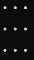

# Chess & Tic-Tac-Toe in C++

This project aims to simulate a Morpion and Chess game. Both of this games needs two players. Both have two modes, PvP and PvC.
The computer is assumed to adopt the less risky strategy, that is, its behaviour is dictated by the well-known MinMax algorithm, or more particularly, its AlphaBeta variant. 

A fair amount of programming skill is required to achieve this projects, as it relies on advanced C++ features such as polymorphisms and the Standard Library.
Also, given the exponential growth of the number of move in Chess, some peculiar care have to be given to the computational costs and memory management.

The Morpion and Chess games derive from the same virtual class: **Position**, **Piece** and **type_piece**; hence they are regrouped in the same repo, but 
keep in mind that they are distinc implementation.

## Tic-Tac-Toe

The implementation is easy and mostly serves of testing case of the overall algorithm. With a correct implementation
of the MinMax algorithm, it is impossible to win a Morpion game, as the adversary will always have a counter available.
Nonetheless, if the player plays a bad move, it can lose. Thus, a standard play ends up in a draw, hence the inherent limited interest
of this case.

  

 

Here is another example where the computer is given the opportunity to win.

  

## Chess

I implemented two modes; a Player Vs. Player (said PvP) and a Player vs. Computer (said PvC). As said above, the PvC is coded with the MinMax algorithm, which requires exploring recursively a tree.
MinMax requires at least two others functions: **Position_possible**, which forms a level of the tree by listing all the potential subsequent positions, and **valeur_position** which computes 
the value of a given position.

The implementation of the Chess game is clearly more tricky, since at every turn, there is on average 40 possibilities of move. If the memory is
not managed correctly, the stack will be very quickly saturated, making the computer have a really bad time. The skeleton of the algorithm is the same than for the Tic-Tac-Toe implementation, 
but the function in details are more diverse and intricate since the game is much richer overall.

The AlphaBeta variant was not necessary in the preceding case
because of the small number of possibility at every turn, its implementation becomes essential for the Chess game though. Otherwise, the computer can be very
long to play for a 4-levels deep tree.
